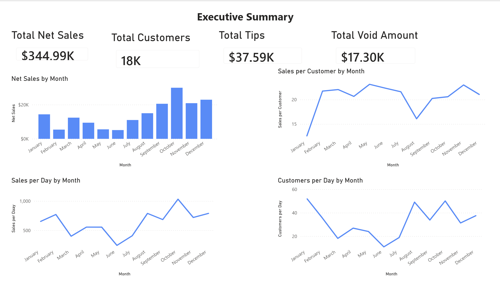
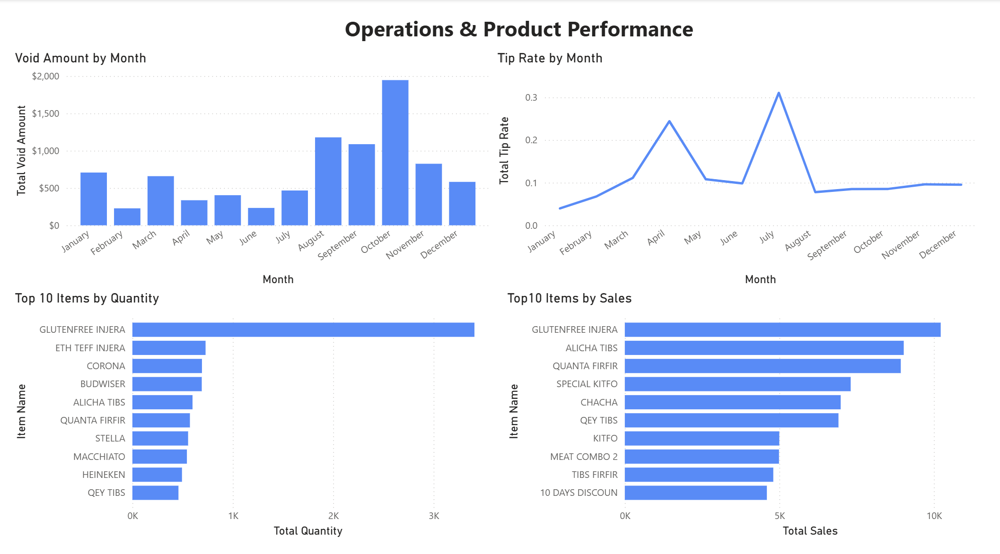

# Restaurant POS Sales & Operations Dashboard

This project analyzes restaurant POS data using Power BI and Excel to understand sales performance, customer activity, operational patterns, and top-selling items.

## Project Overview

The goal of this project was to turn restaurant reporting data into a clear business dashboard that supports decision-making. The dashboard focuses on:

- net sales by month
- sales per day
- customers per day
- sales per customer
- tip rate by month
- void amount by month
- top items by sales
- top items by quantity

## Tools Used

- Power BI
- Excel

## Dashboard Pages

### 1. Executive Summary
This page highlights key business performance metrics, including:
- total net sales
- total customers
- total tips
- total void amount
- net sales by month
- sales per day by month
- customers per day by month
- sales per customer by month

### 2. Operations & Product Performance
This page focuses on:
- void amount by month
- tip rate by month
- top 10 items by quantity
- top 10 items by sales

## Key Insights

- Net sales were strongest in the final quarter, with October showing the highest monthly sales.
- Sales per day varied across months, showing that total sales alone did not fully capture performance.
- Customer traffic fluctuated over time, with some months showing much stronger daily customer volume.
- Sales per customer remained fairly stable overall, with some periods standing out for higher customer spending.
- Void amounts were more concentrated in certain months, suggesting opportunities for operational improvement.
- Product performance was concentrated among a small number of items, with gluten-free injera and several main dishes contributing strongly to both quantity and sales.

## Files Included

- `restaurant_pos_dashboard.pbix` — Power BI dashboard file
- `Dashboard_1.png` — Executive Summary page
- `Dashboard_2.png` — Operations & Product Performance page

## Preview

### Executive Summary

### Operations & Product Performance

